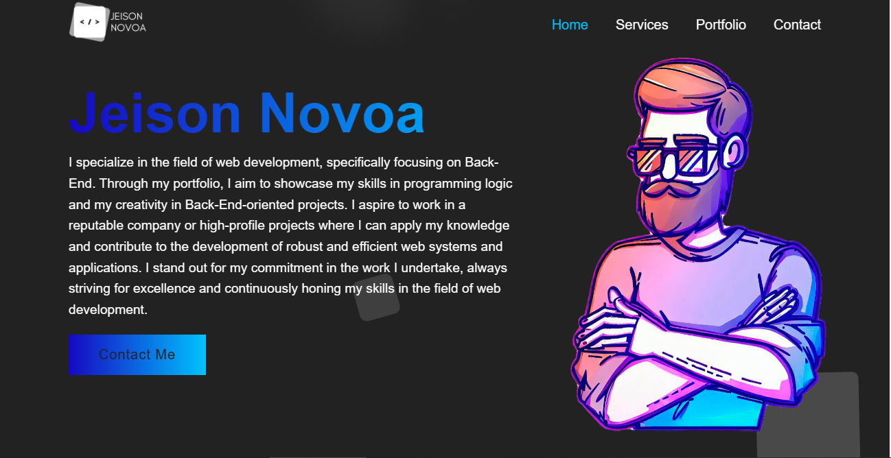
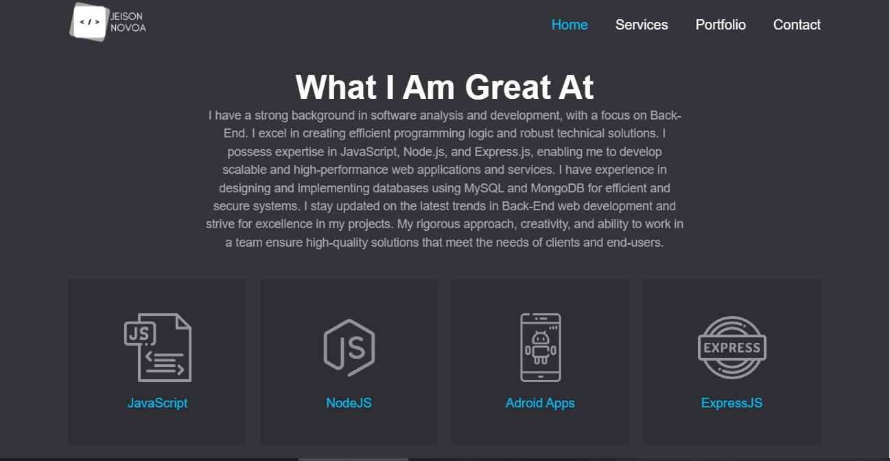
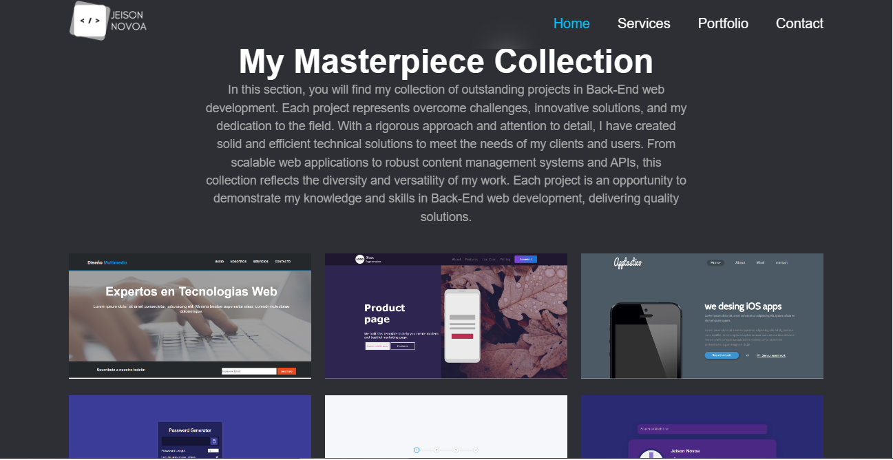
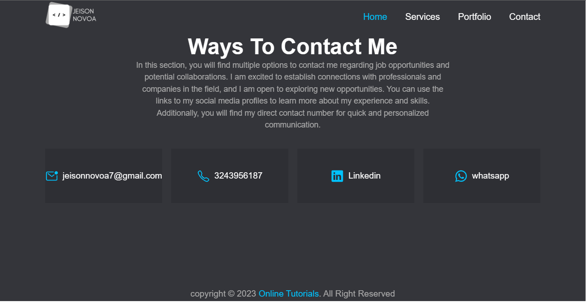

# Back-End Web Development Portfolio

Welcome to my portfolio! This is a collection of my best works in the field of Back-End Web Development. 
Through passion, skill and creativity, I have overcome challenges and created innovative solutions.

## Captura de Pantalla

## Tecnologías Utilizadas

- Lenguajes de programación: JavaScript
- Tecnologias Web: HTML, CSS

## Instrucciones de Uso

1. Clona este repositorio en tu máquina local.
2. Navega a la carpeta del proyecto y abre el archivo "index.html" en tu navegador.

## Enlaces y Recursos Adicionales

- [Página de mi Portafolio en línea](https://github.com/JeisonNovoa/portfolio)
- [Perfil de LinkedIn](https://www.linkedin.com/in/jeison-novoa/)
- [Perfil de GitHub](https://github.com/JeisonNovoa)

## Contacto

Si estás interesado en oportunidades laborales o colaboraciones, puedes contactarme a través de los siguientes medios:

- Correo Electrónico: jeisonnovoa7@gmail.com
- LinkedIn: [tu perfil de LinkedIn](https://www.linkedin.com/in/jeison-novoa/)
- Teléfono: +57 3243956187
